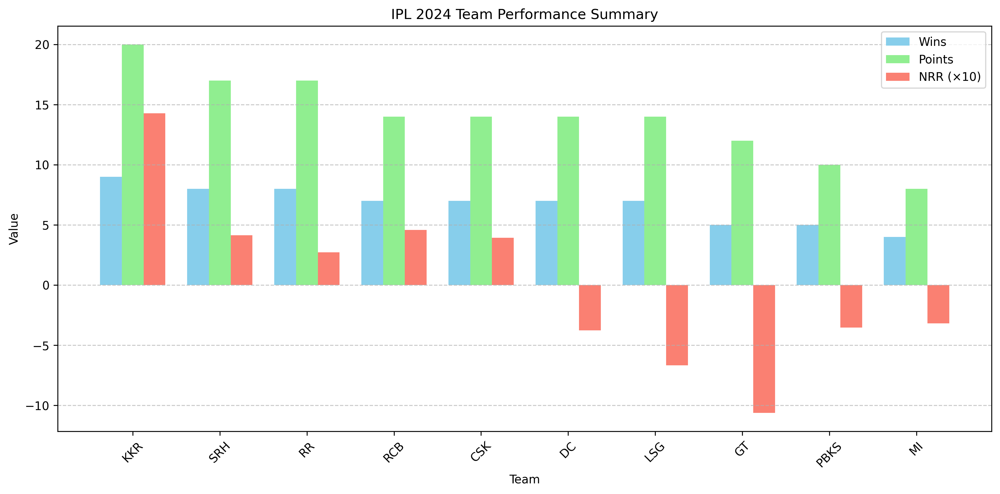
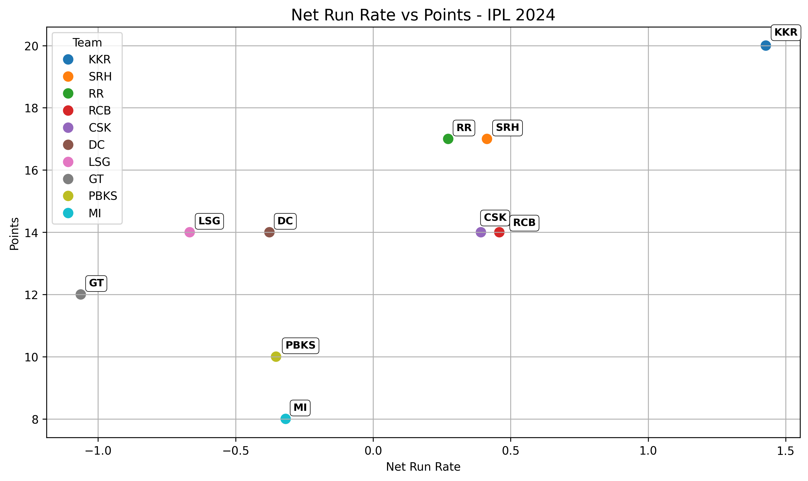

# 🏏 IPL 2024 Data Analysis Project


This project scrapes the latest **IPL 2024 Points Table** using Selenium and BeautifulSoup, then performs data analysis and visualization — all within a single Jupyter notebook.

---

## 📊 Project Highlights

- Cleaned and structured IPL points table data
- Visualized team trends using:
  - Net Run Rate vs Points scatter plot
  - Wins vs Points vs NRR bar chart
  - Recent form streak visualization
- Exported interactive HTML tables using Plotly

## 🧰 Tools Used

- Python 3.12
- Jupyter Notebook
- pandas, matplotlib, seaborn, plotly
- BeautifulSoup & Selenium (for scraping)

## 📁 Folder Structure

```
web_scraping_basics/
├── data/
├── visuals/
├── notebooks/
└── README.md
├── requirements.txt # List of Python dependencies
└── .gitignore # Files/folders to be ignored by Git
```

## 🚀 Features

- Uses **Selenium** to automate browser and extract HTML
- Parses and extracts points table using **BeautifulSoup**
- Saves scraped data to `data/ipl_2024_points_table.csv`
- Performs exploratory analysis with plots (matplotlib/seaborn)

---


## 📷 Visual Outputs

| Chart                             | Description                           |
|----------------------------------|---------------------------------------|
|  | Bar chart comparing Wins, Points, NRR |
|    | Scatter of Net Run Rate vs Points     |

## 🔗 Interactive Table

Open [`interactive_table.html`](visuals/interactive_table.html) in your browser for an interactive summary.

---

## 💡 Future Scope

- Add player-level insights
- Include match-by-match breakdown
- Integrate live API for real-time updates

---
## 🙋‍♀️ Author

Vyamsani T V A Haripriya  
Data Analyst | Python & ML Enthusiast